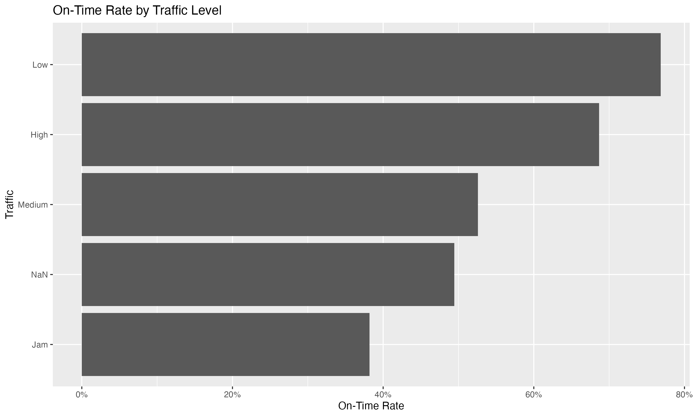
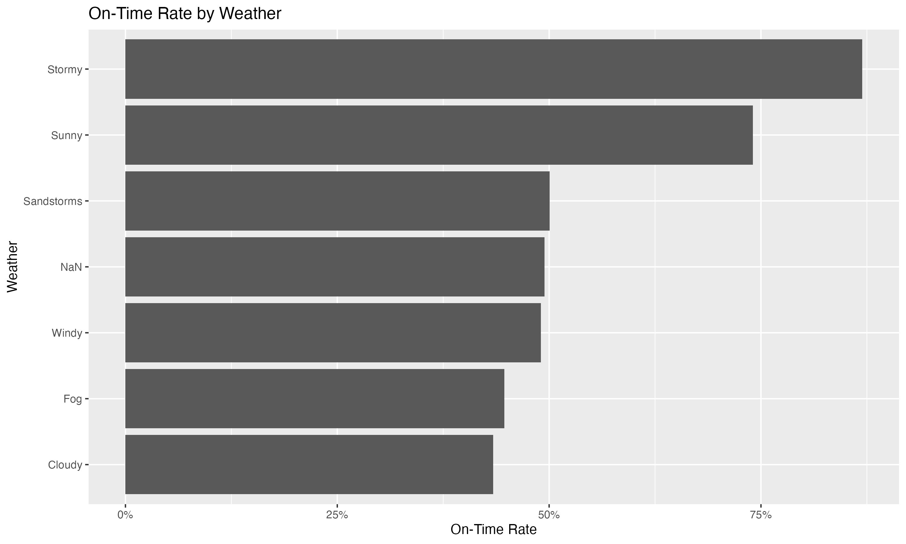
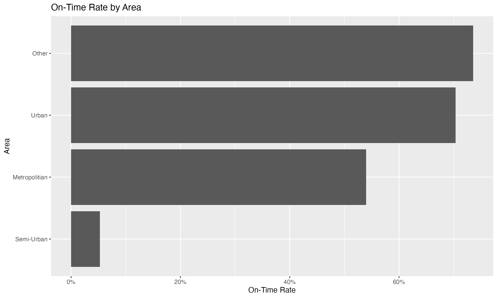
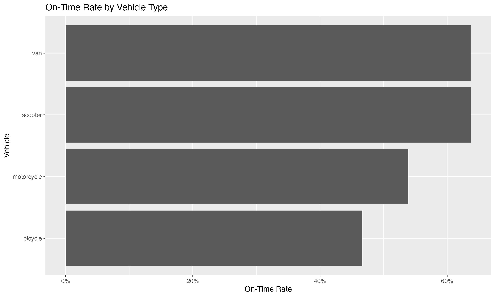
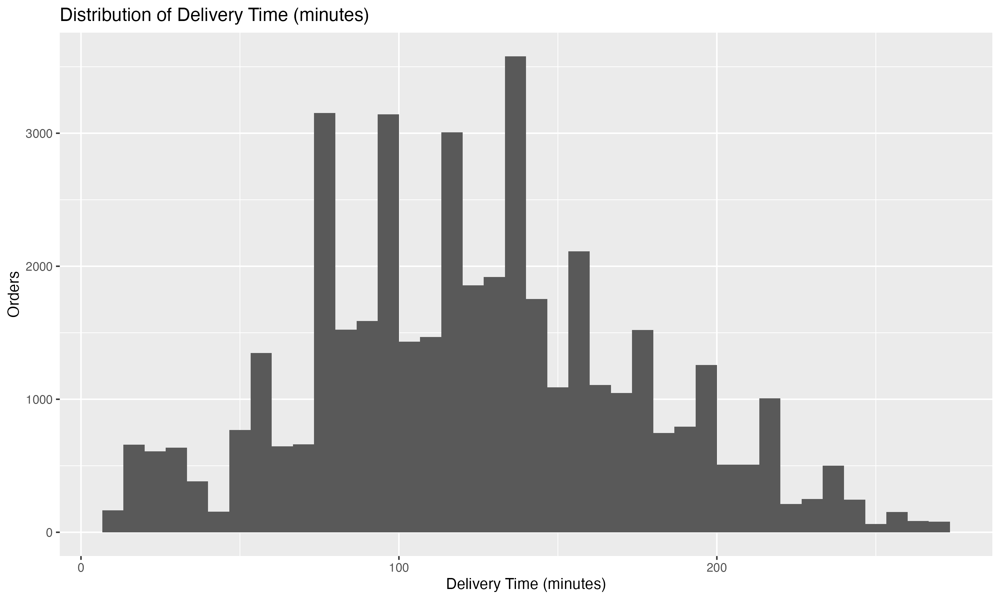
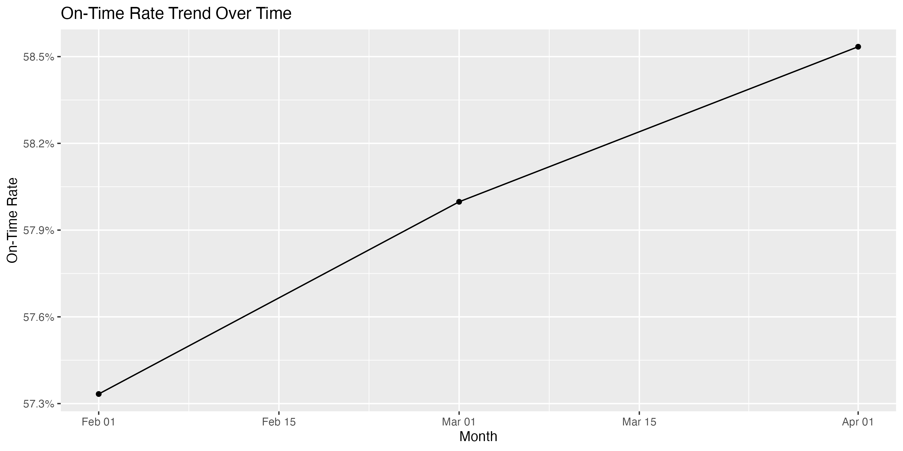

```{r setup, include=FALSE}
knitr::opts_chunk$set(echo = FALSE, message = FALSE, warning = FALSE)

library(tidyverse)
library(readr)
library(scales)
```

# Executive Summary

This project analyzes last-mile delivery performance using an Amazon delivery dataset.

The objective is to:

- Measure SLA compliance  
- Identify key structural drivers of delivery time  
- Quantify operational improvement impact  
- Provide strategic recommendations  

---

# Data Sources

This report reads processed datasets created by earlier scripts:

- ../data/processed/shipping_kpis.csv  
- ../data/processed/model_coefficients.csv  
- ../data/processed/model_fit_summary.csv  
- ../data/processed/impact_summary.csv  
- ../data/processed/segment_performance.csv  

And visual exports:

- ../outputs/figures/*.png  

---

# Executive KPIs

```{r}
df <- read_csv("../data/processed/shipping_kpis.csv", show_col_types = FALSE)

exec_kpis <- df %>%
  summarise(
    total_orders = n(),
    avg_delivery_time = round(mean(delivery_time, na.rm = TRUE), 2),
    on_time_rate = percent(mean(on_time, na.rm = TRUE)),
    avg_delay_minutes = round(mean(delay_minutes, na.rm = TRUE), 2),
    late_orders = sum(on_time == 0, na.rm = TRUE)
  )

exec_kpis
```

---

# Segment Performance Overview

```{r}
segment_perf <- read_csv("../data/processed/segment_performance.csv", show_col_types = FALSE)

segment_perf %>%
  group_by(segment) %>%
  arrange(on_time_rate, .by_group = TRUE) %>%
  summarise(
    worst_segment = paste0(first(segment_value), " (", percent(first(on_time_rate)), ")"),
    best_segment  = paste0(last(segment_value),  " (", percent(last(on_time_rate)),  ")"),
    .groups = "drop"
  )
```

---

# Regression Model

Model specification:

delivery_time ~ traffic + weather + vehicle + area + agent_age + agent_rating

## Model Fit

```{r}
fit <- read_csv("../data/processed/model_fit_summary.csv", show_col_types = FALSE)
fit
```

## Top Drivers by Impact

```{r}
coef_table <- read_csv("../data/processed/model_coefficients.csv", show_col_types = FALSE)

coef_table %>%
  select(term, estimate, std.error, statistic, p.value) %>%
  arrange(desc(abs(estimate))) %>%
  head(15)
```

Interpretation:

- Positive estimate increases delivery time  
- Negative estimate reduces delivery time  
- Larger magnitude indicates stronger operational influence  

---

# Business Impact Simulation

```{r}
impact <- read_csv("../data/processed/impact_summary.csv", show_col_types = FALSE)
impact
```

This quantifies:

- Time savings from improving agent rating  
- Structural delay burden in Semi-Urban areas  
- Traffic Jam impact  

---

# Visual Performance Insights

## On-Time Rate by Traffic

```{r}

```

## On-Time Rate by Weather

```{r}

```

## On-Time Rate by Area

```{r}

```

## On-Time Rate by Vehicle

```{r}

```

## Delivery Time Distribution

```{r}

```

## On-Time Trend

```{r}

```

---

# Strategic Recommendations

1. Improve agent performance management  
   Agent rating shows strong impact on delivery time.

2. Re-structure Semi-Urban routing  
   Significant structural delay burden identified.

3. Implement traffic-aware dispatch logic  
   Jam conditions materially increase delivery time.

4. Review vehicle allocation strategy  
   Optimize vehicle use for congestion exposure.

---

# Conclusion

This project demonstrates a complete logistics analytics workflow:

Data Engineering  
→ KPI Definition  
→ Statistical Modeling  
→ Impact Quantification  
→ Executive Reporting  

The framework mirrors real-world supply chain analytics practice and supports decision-driven performance improvement.